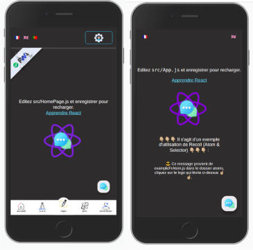
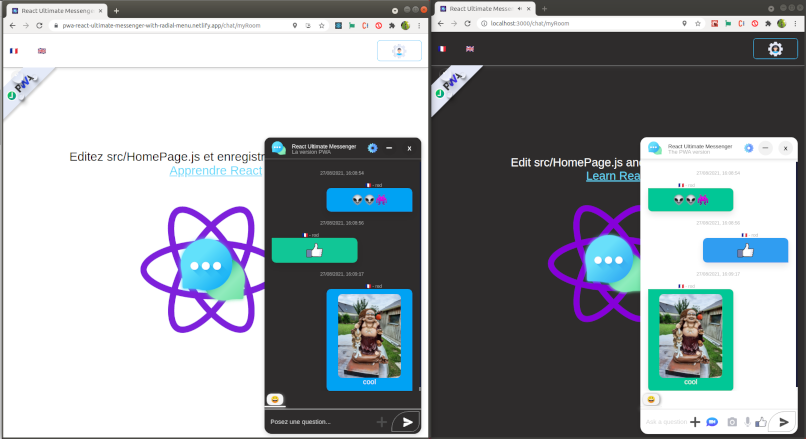
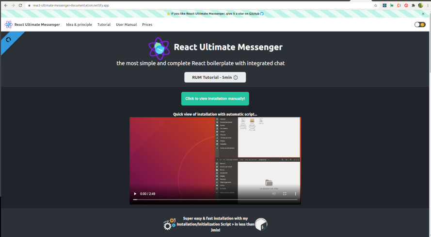
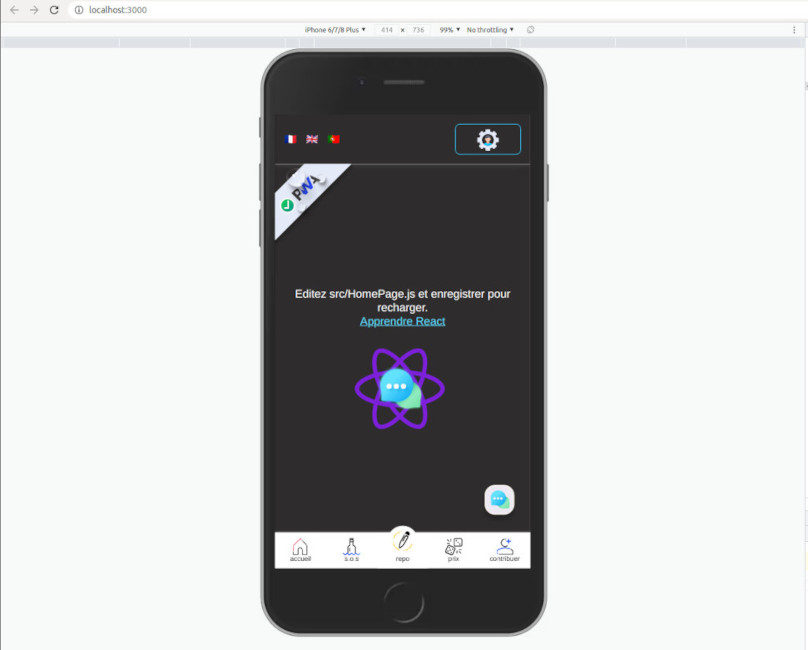
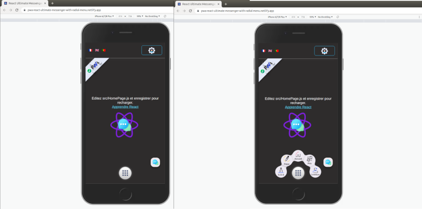
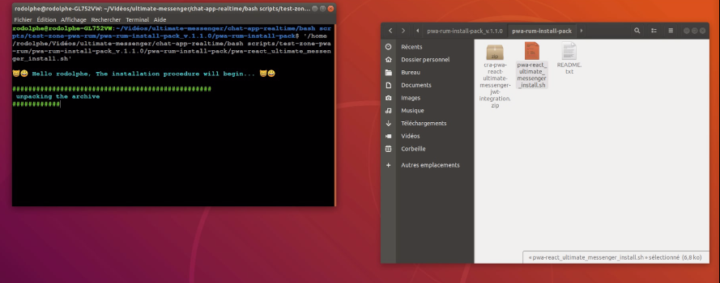

# PWA React Ultimate Messenger template for React (create-react-app tools)

## Mutlilingual App!

> ***This PWA Application is multilingual by default.***
>
>***Languages :  🇨🇵 🇬🇧 🇵🇹***

---

## PWA RUM & Classic RUM quick view
>

---

## PWA ChatApp component Overview

>

---

## Full documentation site

**You can go directly to the complete documentation site about the application and its different versions available.** **[here](https://react-ultimate-messenger-documentation.netlify.app/docs/pwa-version/pwa-version-installation)**,

---

## PWA Online Demo sites

**You can try PWA React Ultimate Messenger**

>
>
> 
>
> **[With Classic bottom menu](https://pwa-react-ultimate-messenger-with-bottom-menu.netlify.app/)**

---

>
>
> 
>
> **[With Radial burger menu](https://pwa-react-ultimate-messenger-with-radial-menu.netlify.app/)**

---

(The demo is not fully functional without the server started locally*)

> *you can only send/receive messages if you have the server locally on your machine -

 I explain how to test the online version with your local version in the documentation site...

 ---

## PWA Install pack repository:
**[Pack with automatic installation/configuration script](https://github.com/rodolphe37/pwa-rum-install-pack)**
>

---

## Author

- Thought, designed and developed with :purple_heart: by Rodolphe Augusto

---

## A few words from the author

Enjoy the World :smirk:

## :sparkling_heart: Support the project

I put almost everything open-source I can, and try to accommodate anyone who needs help using these projects. Obviously,
this takes time. You can use this service for free.

However, if you are using this project and are happy with it or just want to encourage me to keep creating:

- You can make donation in [This page](https://react-ultimate-messenger-documentation.netlify.app/prices#open-modal2) for support the project

- Put a star and share the project :rocket:

Thank you! :heart:

## License

MIT

---
